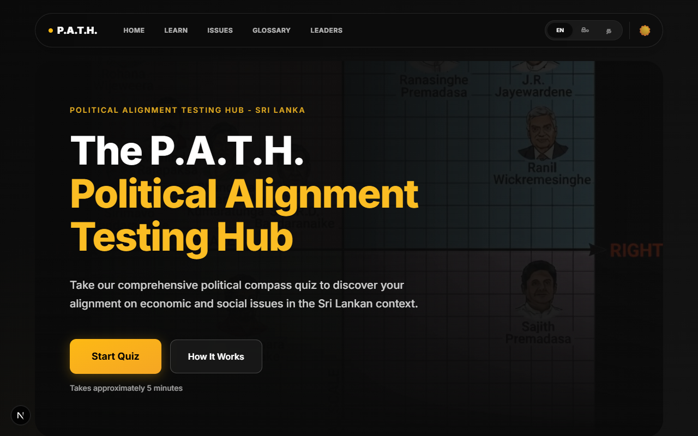
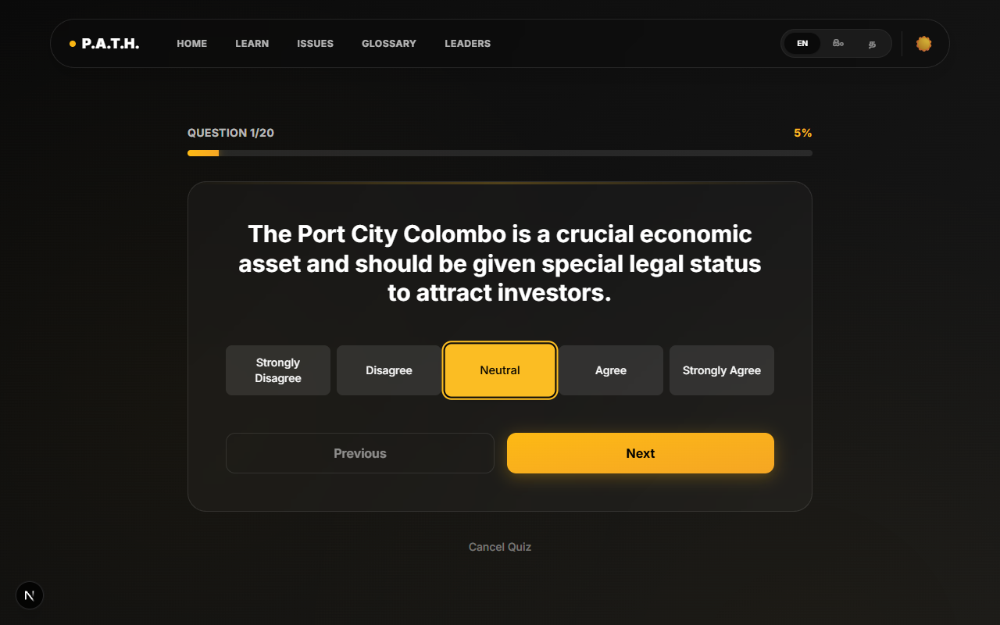
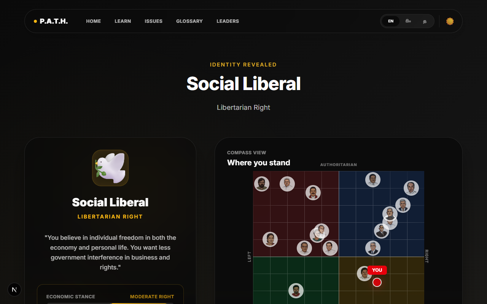
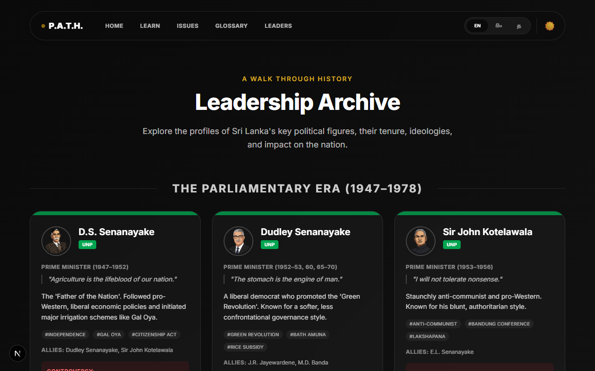

# The P.A.T.H. - Political Alignment Testing Hub (Sri Lanka)

A production-ready, trilingual (English, Sinhala, Tamil) political compass web application for Sri Lanka. Built with Next.js 16, this app measures users on two axes (Economic: Left/Right, Social: Authoritarian/Liberal) and matches them to historical Sri Lankan politicians.

## 🌟 Features

- **Trilingual Support**: Full support for English, Sinhala, and Tamil
- **20 Curated Questions**: 10 economic and 10 social questions specific to Sri Lankan politics
- **Interactive Quiz**: Smooth slider-based interface for answering questions
- **Political Compass Visualization**: Beautiful scatter plot showing user position and historical politicians
- **Dynamic Floating Hero**: Immersive home page featuring floating historical figures with parallax-like organic motion
- **Leadership Archive**: Detailed profiles of historical and current leaders with localized biographies, quotes, controversies, and key allies. Divided into "Parliamentary Era" and "Executive Presidency".
- **Civic Education Modules**: A dedicated "Learn" section tailored for Sri Lankan citizens:
  - **Timeline of Turning Points**: A scrollable "Metro Map" style timeline of Sri Lanka's political history (1948-2022).
  - **Fundamental Rights**: Interactive cards explaining key constitutional rights (Articles 10-14A).
  - **Glossary**: Key political terms (e.g., "Unitary State", "Neoliberalism") defined in all three languages.
  - **MythBusters**: Common political myths debunked with economic realities.
  - **Government Structures**: Visual guides to the Executive, Legislature, and Judiciary.
- **Politician Matching**: Algorithm to find the closest historical Sri Lankan politician to your ideology
- **Unified Profile Card**: Generate high-quality, downloadable profile cards combining your archetype and compass result
- **Dark/Gold Theme**: Premium classy design with black backgrounds and gold accents, consistent across all new modules
- **Fully Client-Side**: No database required, runs entirely in the browser

## 🛠️ Tech Stack

- **Framework**: Next.js 16 (App Router)
- **Language**: JavaScript (ES6+)
- **Styling**: Tailwind CSS v4
- **UI Components**: Custom components with Shadcn/UI principles
- **Charts**: Chart.js with react-chartjs-2
- **Internationalization**: next-intl
- **OG Images**: Vercel OG

## 📊 Political Compass Axes

### Economic Axis (X-axis)

- **Left (-10)**: State control, subsidies, protectionism, wealth redistribution
- **Right (+10)**: Free market, privatization, low taxes, foreign investment

### Social Axis (Y-axis)

- **Libertarian (-10)**: Decentralization, civil liberties, democratic reforms
- **Authoritarian (+10)**: Centralization, security focus, traditional values

## 🏛️ Leadership Archive

Includes detailed profiles for:

**The Executive Presidency (1978–Present):**

1. **J.R. Jayewardene** (UNP)
2. **Ranasinghe Premadasa** (UNP)
3. **D.B. Wijetunga** (UNP)
4. **Chandrika Bandaranaike** (SLFP)
5. **Mahinda Rajapaksa** (SLPP)
6. **Maithripala Sirisena** (SLFP)
7. **Gotabaya Rajapaksa** (SLPP)
8. **Ranil Wickremesinghe** (UNP)
9. **Anura Kumara Dissanayake** (NPP)

**The Parliamentary Era (1947–1978):**

1. **D.S. Senanayake** (UNP)
2. **Dudley Senanayake** (UNP)
3. **Sir John Kotelawala** (UNP)
4. **S.W.R.D. Bandaranaike** (SLFP)
5. **W. Dahanayake** (Ind)
6. **Sirimavo Bandaranaike** (SLFP)

## 📷 Screenshots

### Home Page & Language Selection



### Interactive Quiz



### Detailed Result Analysis



### Leadership Archive



## 🚀 Getting Started

### Prerequisites

- Node.js 18+
- npm or yarn

### Installation

1. Clone the repository:

```bash
git clone <repository-url>
cd path-app
```

2. Install dependencies:

```bash
npm install
```

3. Run the development server:

```bash
npm run dev
```

4. Open [http://localhost:3000](http://localhost:3000) in your browser

### Build for Production

```bash
npm run build
npm start
```

## 📂 Project Structure

```
path-app/
├── app/
│   ├── [locale]/           # Locale-based routing
│   │   ├── page.js         # Home page
│   │   ├── learn/          # NEW: Educational modules
│   │   │   ├── history/    # Timeline page
│   │   │   ├── civics/     # Civics page
│   │   │   ├── myths/      # MythBusters page
│   │   │   ├── constitution/ # Constitution page
│   │   │   └── elections/    # Elections page
│   │   ├── quiz/
│   │   │   └── page.js     # Quiz page
│   │   ├── results/
│   │   │   └── page.js     # Results page
│   │   ├── leaders/        # Leadership Archive
│   │   ├── glossary/       # Glossary
│   │   ├── methodology/    # Methodology
│   │   └── issues/         # Issues page
│   ├── api/
│   │   └── og/
│   │       └── route.js    # OG image generation
│   └── globals.css         # Global styles
├── data/
│   ├── questions.js        # Question bank
│   ├── politicians.js      # Compass data
│   ├── leaders.js          # Leadership profiles
│   ├── history.js          # Timeline data
│   ├── rights.js           # Fundamental rights data
│   ├── ideologies.js       # Political ideologies data
│   ├── glossary.js         # Glossary terms
│   ├── myths.js            # Political myths
│   └── structures.js       # Govt structure data
├── i18n/
│   └── routing.js          # i18n routing config
├── messages/
│   ├── en.json            # English translations
│   ├── si.json            # Sinhala translations
│   └── ta.json            # Tamil translations
├── i18n.js                # i18n configuration
├── middleware.js          # Locale detection
└── next.config.mjs        # Next.js configuration
```

## 🎨 Design System

### Colors

- **Background**: `#000000` (Pure Black)
- **Card Background**: `#0A0A0A`
- **Card Border**: `#1A1A1A`
- **Gold**: `#D4AF37`
- **Gold Dark**: `#B8941F`
- **Gold Light**: `#E8C547`
- **Text**: `#FFFFFF` (White)

### Typography

- **Font**: Inter (with fallbacks)
- **Headings**: Bold, gradient gold effect
- **Body**: Regular weight, white text

## 🌐 Internationalization

The app supports three languages with full translations:

- English (`/en`)
- Sinhala (`/si`)
- Tamil (`/ta`)

Language switching is automatic based on URL, with a language selector on the home page.

## 📊 Scoring Algorithm

1. Each question has a specific effect (+1 or -1) on an axis
2. User answers range from -2 (Strongly Disagree) to +2 (Strongly Agree)
3. Score = Answer × Question Effect / 2
4. Final scores are normalized to -10 to +10 range
5. Euclidean distance is used to find the closest politician

## 🔗 API Routes

### `/api/og`

Generates dynamic OG images for social sharing.

**Query Parameters:**

- `x`: Economic score (-10 to 10)
- `y`: Social score (-10 to 10)
- `locale`: Language code (en, si, ta)

**Example:**

```
/api/og?x=5.5&y=-2.0&locale=en
```

## 📱 Responsive Design

The app is fully responsive and works on:

- Desktop (1920px+)
- Laptop (1024px+)
- Tablet (768px+)
- Mobile (320px+)

## 🚢 Deployment

This app is optimized for deployment on Vercel:

1. Push your code to GitHub
2. Import the project in Vercel
3. Deploy!

The app will automatically:

- Build the Next.js app
- Generate static pages where possible
- Enable edge functions for OG images

## 🗳️ Feedback & Issues

This is a personal portfolio project. While I am not actively seeking code contributions, I welcome feedback, bug reports, and suggestions. Please feel free to open an issue on GitHub.

## 📧 Contact

For questions or feedback, please open an issue on GitHub.

## ⚖️ Copyright & Usage

This project is shared publicly for portfolio and educational purposes. **All rights are reserved.**

- **Ownership**: The creator retains full ownership of the codebase. Copying, modifying, or using this code for commercial purposes/rival products without permission is strictly prohibited.
- **GitHub**: As per GitHub's Terms of Service, users are permitted to view and fork this repository, but this does not grant rights to reuse the code for other purposes.

---

**Built with ❤️ for Sri Lankan democracy**
